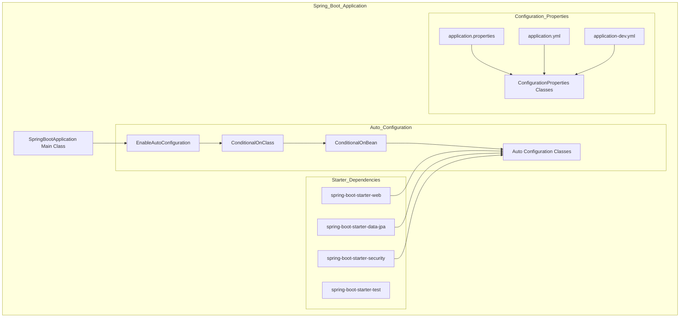
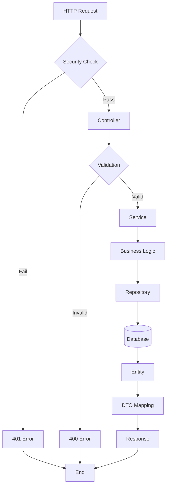
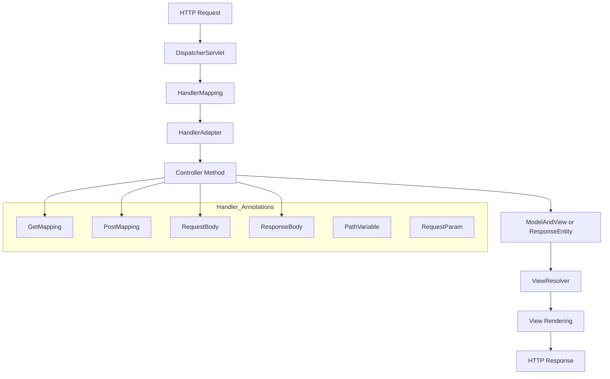
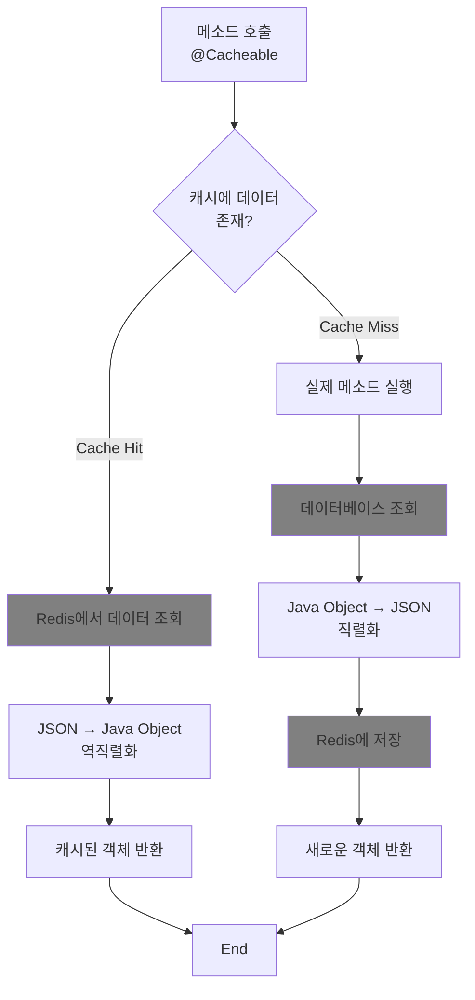

## SpringApplication 핵심 기능

<details>
<summary> ✅ 스프링 애플리케이션 지연 초기화</summary>

스프링 부트는 기본 실행 시 모든 빈을 실행시키고 초기화 합니다. <br>
하지만 지연 초기화를 이용하게 되면 꼭 필요한 빈들만 먼저 초기화하고 
지연 설정을 한 빈들은 실제로 사용할 때 초기화 시키므로 스프링부트 앱 시작 시간을 단축 시키거나 초기 부하를 줄일 수 있습니다.

```java
public class SpringbootReferenceGuideApplication {
    public static void main(String[] args) {
        SpringApplication application = new SpringApplication(SpringbootReferenceGuirdeApplication.class);
        application.setLazyInitialization(true);
        application.run(args);
    }
}
```

#### builder 패턴
```java
public class SpringbootReferenceGuideApplication {
    public static void main(String[] args) {
        new SpringApplicationBuilder(SpringbootReferenceGuirdeApplication.class)
                .lazyInitialization(true)
                .run(args);
    }
}
```

#### properties , yml 으로 설정

```properties
spring.main.lazy-initialization=true (Properties)
```

```yaml
spring:
  main:
    lazy-initialization: true (YAML)
```
</details>

<details>
<summary>✅ SpringBootApplication 클래스와 애플리케이션 시작을 관찰하는 방법</summary>

- ApplicationStartup 인터페이스와 StartupStep 객체를 사용하여 애플리케이션 실행 시 관찰 가능

```java
public class SpringbootReferenceGuideApplication {
    public static void main(String[] args) {
        SpringApplication application = new SpringApplication(SpringBootReferenceGuideApplication.class);

        BufferingApplicationStartup startup = new BufferingApplicationStartup(2048);
        application.setApplicationStartup(startup);

        ConfigurableApplicationContext context = application.run(args);

        System.out.println("\n=== 🚀 시작 과정 분석 ===");
        startup.getBufferedTimeline().getEvents().forEach(event -> {
            StartupStep step = event.getStartupStep();

            // 빈 이름 찾기
            String beanName = "";
            for (StartupStep.Tag tag : step.getTags()) {
                if ("beanName".equals(tag.getKey())) {
                    beanName = " [빈: " + tag.getValue() + "]";
                    break;
                }
            }

            long duration = event.getDuration().toMillis();
            if (duration > 0) { // 0ms는 생략
                System.out.println(step.getName() + beanName + " : " + duration + "ms");
            }
        });
    }
}
```
</details>


<details>
<summary>✅ SpringBootApplication 의 이벤트</summary>

- **ApplicationStartingEvent**: SpringApplication.run 메서드가 시작될 때, 즉 리스너 및 초기화 도구 등록 외의 어떠한 처리도 시작되기 전에 전송됩니다.
  - **ApplicationEnvironmentPreparedEvent**: ApplicationContext가 생성되기 전에 사용될 Environment가 준비되었을 때 전송됩니다.
  - **ApplicationContextInitializedEvent**: ApplicationContext가 준비되고 ApplicationContextInitializer가 호출되었지만, 아직 빈 정의가 로드되기 전에 전송됩니다.
  - **ApplicationPreparedEvent**: 이 이벤트 이후 및 ApplicationStartedEvent 이전에 WebServerInitializedEvent와 ContextRefreshedEvent 같은 추가 이벤트가 발행됩니다.
  - **ApplicationStartedEvent**: ApplicationContext가 새로고침된 후, 하지만 커맨드 라인 러너 및 애플리케이션 러너가 호출되기 전에 전송됩니다.
  - **ApplicationReadyEvent**: 애플리케이션이 요청 처리를 시작할 준비가 되었음을 나타내며, CommandLineRunner와 ApplicationRunner 컴포넌트가 호출된 후 전송됩니다. 이는 애플리케이션의 "준비 상태(Readiness State)"와 관련이 있습니다.
  - **ApplicationFailedEvent** : 시작 중에 예외가 발생하면 전송됩니다

### 이벤트 리스너에 이벤트 등록 방법
- 각각의 이벤트 처리를 위해 리스너를 등록하는 방법은 이벤트 발생 시점에 따라 달라진다.

ApplicationContext 생성 이전 이벤트 ApplicationStartingEvent 나 ApplicationEnvironmentPreparedEvent 는 , 리스너를 @Bean 으로 등록 할 수 없지만
다음과 같은 방법을 사용하여 등록한다.
반대로 생성 이후 이벤트는 @Bean 으로 등록하여 사용 할 수 있다.

SpringApplication.addListeners(...) 메서드를 호출하여 프로그래밍 방식으로 등록.
SpringApplicationBuilder.listeners(...) 메서드를 사용합니다.

```java
// 등록할 리스너 클래스 생성
public class EnvironmentListener implements ApplicationListener<ApplicationEnvironmentPreparedEvent> {

    @Override
    public void onApplicationEvent(ApplicationEnvironmentPreparedEvent event) {
        System.out.println("🌍 환경 설정 준비 시작..!");
        
        // 환경 변수 설정 확인 코드..
        
        System.out.println("🌍 환경 설정 준비 완료..!");
    }
}
```
#### 실행 시
```java
public class SpringbootReferenceGuideApplication {
    public static void main(String[] args) {
        // ApplicationEnvironmentPreparedEvent
        SpringApplicationBuilder springApplicationBuilder = new SpringApplicationBuilder(SpringbootReferenceGuideApplication.class);
        springApplicationBuilder.listeners(new EnvironmentListener());
        springApplicationBuilder.run(args);  
        
    }
}
```

### ❗ 주의 사항
- **동일 스레드 실행** : 애플리케이션 이벤트 리스너는 기본적으로 동일한 스레드에서 실행되므로, 잠재적으로 시간이 오래 걸리는 작업을 리스너에서 실행하지 않도록 주의.
- **컨텍스트 계층** : 애플리케이션이 SpringApplication 인스턴스의 계층 구조를 사용하는 경우, 리스너가 동일한 유형의 애플리케이션 이벤트를 여러 번 수신할 수 있다. 이를 구분하려면 리스너에서 ApplicationContext를 주입받아 이벤트의 컨텍스트와 비교해야 함.

💬 <br>요약하면, SpringApplication은 애플리케이션의 생명 주기 동안 발생하는 중요한 이벤트들을 발행하며, 개발자는 이러한 이벤트를 활용하여 애플리케이션의 시작 과정을 관찰하고, 특정 단계에서 필요한 로직을 실행하며, 문제를 진단하고 해결할 수 있도록 다양한 메커니즘과 유연성을 제공합니다.

</details>

<details>
<summary>✅ApplicationArguments 와  ApplicationRunner / CommandLineRunner</summary> 

### ApplicationArguments
- 애플리케이션 인수를 빈 내부에서 직접 조회하여 활용할 때 사용 가능합니다.
- 명령행 인수에 따라 다르게 동작해야 할 때 사용합니다.

```java
@Component
public class DataInitializer implements ApplicationRunner {
    
    @Autowired
    private UserService userService;
    
    @Override
    public void run(ApplicationArguments args) throws Exception {
        // args 에 --init-data 옵션이 있을 때만 초기 데이터 생성
        if (args.containsOption("init-data")) {
            System.out.println("🗄️ 초기 데이터 생성 중...");
            createInitialData();
        }
        
        // args 에 --create-admin 옵션이 있을 때만 관리자 계정 생성
        if (args.containsOption("create-admin")) {
            String email = args.getOptionValues("create-admin").get(0);
            System.out.println("👑 관리자 계정 생성: " + email);
            userService.createAdminUser(email);
        }
        
        // args 에 --sample-size 옵션으로 샘플 데이터 개수 지정
        if (args.containsOption("sample-size")) {
            int size = Integer.parseInt(args.getOptionValues("sample-size").get(0));
            System.out.println("🧪 샘플 데이터 " + size + "개 생성 중...");
            createSampleData(size);
        }
    }
}
```


###  ApplicationRunner / CommandLineRunner
- Spring 애플리케이션의 시작 프로세스 완료 후 특정 로직을 실행해야 할 때 유용합니다.
- 애플리케이션 시작부터 존재해야하는 관리자 계정이나 , 초기 데이터를 필요로 할 때 사용할 수 있습니다.

```java
@Component  // ← 이것만 있으면 자동 등록!
public class DataInitializer implements ApplicationRunner {
    
    @Autowired
    private UserRepository userRepository;
    
    @Autowired  
    private RoleRepository roleRepository;
    
    @Override
    public void run(ApplicationArguments args) throws Exception {
        System.out.println("🗄️ 초기 데이터 로딩 시작...");
        
        // 기본 역할 데이터 생성
        if (roleRepository.count() == 0) {
            roleRepository.save(new Role("ADMIN"));
            roleRepository.save(new Role("USER"));
            System.out.println("✅ 기본 역할 데이터 생성 완료");
        }
        
        // 관리자 계정 생성
        if (userRepository.findByEmail("admin@example.com").isEmpty()) {
            User admin = new User("admin@example.com", "admin123");
            userRepository.save(admin);
            System.out.println("✅ 관리자 계정 생성 완료");
        }
    }
}
```
#### ApplicationRunner 실행 순서의 위치
```text
1. SpringApplication.run() 시작
2. Spring Context 초기화
3. 모든 Bean 생성 (@Component 스캔)
4. DataInitializer Bean 생성됨
5. 웹 서버 시작 (Tomcat 등)
6. 애플리케이션 시작 완료
7. 🚀 ApplicationRunner 자동 실행 ← DataInitializer.run() 호출!
8. CommandLineRunner 실행 (있다면)
9. ApplicationReadyEvent 발생
```
#### 여러 개의 Runner 가 있다면 @Order 로 실행 순서 제어

```java
@Component
@Order(1)  // 첫 번째로 실행
public class ConfigValidator implements ApplicationRunner {
    @Override
    public void run(ApplicationArguments args) throws Exception {
        System.out.println("1️⃣ 설정 검증 중...");
    }
}

@Component
@Order(2)  // 두 번째로 실행  
public class DataInitializer implements ApplicationRunner {
    @Override
    public void run(ApplicationArguments args) throws Exception {
        System.out.println("2️⃣ 데이터 초기화 중...");
    }
}

@Component
@Order(3)  // 세 번째로 실행
public class CacheWarmer implements ApplicationRunner {
    @Override
    public void run(ApplicationArguments args) throws Exception {
        System.out.println("3️⃣ 캐시 워밍업 중...");
    }
}

// 메인 클래스는 여전히 그대로!
@SpringBootApplication
public class MyApp {
    public static void main(String[] args) {
        SpringApplication.run(MyApp.class, args);
    }
}
```

</details>


## SpringBoot 구조 / Flowchart
<details>
<summary>스프링 부트 핵심 구조</summary>


</details>

<details>
<summary>처리 흐름</summary>


</details>

<details>
<summary>Web MVC 요청 처리</summary>



</details>


<details>
<summary>redis 캐시 흐름</summary>



</details>
